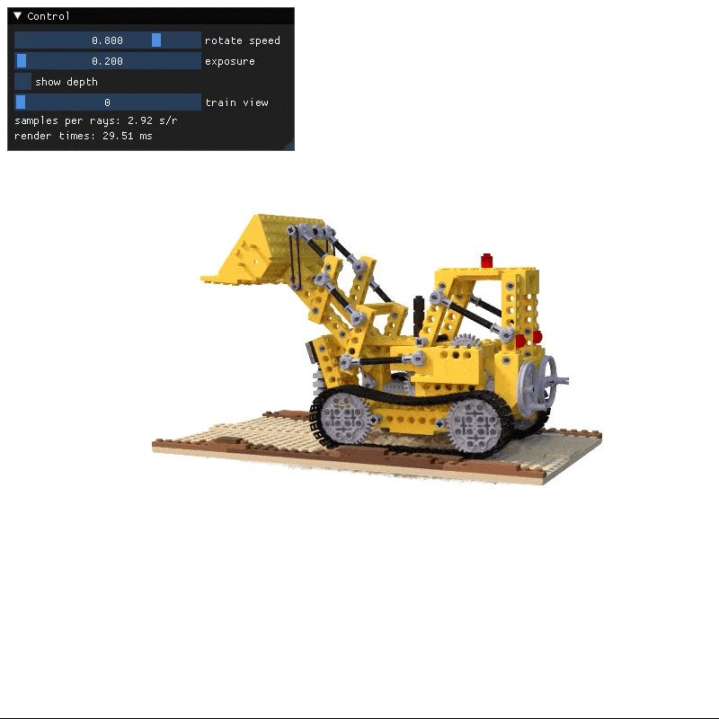

# Taichi NeRFs

A PyTorch + Taichi implementation of [instant-ngp](https://nvlabs.github.io/instant-ngp/assets/mueller2022instant.pdf) NeRF training pipeline. For more details about modeling, please checkout this [article on our blog site](https://docs.taichi-lang.org/blog/taichi-instant-ngp).

<p align="center">

</p>

## Installation

1. Install PyTorch by `python -m pip install torch torchvision --extra-index-url https://download.pytorch.org/whl/cu116` (update the url with your installed CUDA Toolkit version number).
2. Install taichi nightly via `pip install -U pip && pip install -i https://pypi.taichi.graphics/simple/ taichi-nightly`.
3. Install requirements by `pip install -r requirements.txt`.
4. If you plan to train with your own video, please install `colmap` via `sudo apt install colmap` or follow instructions at https://colmap.github.io/install.html.

## Train with preprocessed datasets

### Synthetic NeRF

Download [Synthetic NeRF dataset](https://dl.fbaipublicfiles.com/nsvf/dataset/Synthetic_NeRF.zip) and unzip it. Please keep the folder name unchanged.


We also provide a script to train the Lego scene from scratch, and display an interactive GUI at the end of the training.

```bash
./scripts/train_nsvf_lego.sh
```

<p align="center">

</p>

Performance is measured on a Ubuntu 20.04 with an RTX3090 GPU.

| Scene | avg PSNR | Training Time(20 epochs) |   GPU   |
| :---: | :------: | :----------------------: | :-----: |
| Lego  |   35.0   |           208s           | RTX3090 |

To reach the best performance, here are the steps to follow:
1. Your work station is running on Linux and has RTX 3090 Graphics card
2. Follow the steps in [Installation Section](https://github.com/taichi-dev/taichi-nerfs#installation)
3. Uncomment `--half2_opt` to enable half2 optimization in the script, then `./scripts/train_nsvf_lego.sh`. For now, half2 optimization is only supported on Linux with Graphics Card Architecture >Pascal.


### 360_v2 dataset

Download [360 v2 dataset](http://storage.googleapis.com/gresearch/refraw360/360_v2.zip) and unzip it. Please keep the folder name unchanged. The default `batch_size=8192` takes up to 18GB RAM on a RTX3090. Please adjust `batch_size` according to your hardware spec. 

```bash
./scripts/train_360_v2_garden.sh
```

## Train with your own video

Place your video in `data` folder and pass the video path to the script. There are several key parameters for producing a sound dataset for NeRF training. For a real scene, `scale`  is recommended to set to 16. `video_fps` determines the number of images generated from the video, typically 150~200 images are sufficient. For a one minute video, 2 is a suitable number. Running this script will preprocess your video and start training a NeRF out of it:

```
./scripts/train_from_video.sh -v {your_video_name} -s {scale} -f {video_fps}
```

## Mobile Deployment

[Taichi NGP Deployment](deployment/InstantNGP)

Using [Taichi AOT](https://docs.taichi-lang.org/docs/tutorial), you can easily deploy a NeRF rendering pipeline on any mobile devices!

<p align="center">
 

</p>

We're able to achieve real-time interactive on iOS devices.

| Performance | iPad Pro (M1) | iPhone 14 Pro Max | iPhone 14 |
| --- | --- | --- | --- |
| Taichi Instant NGP | 22.4 fps | 18 fps | 13.5 fps |

Stay tuned, more cool demos are on the way! For business inquiries, please reach out us at `contact@taichi.graphics`.

## Text to 3D 
Taichi-nerf serves as a new backend of the text-to-3D project [stable-dreamfusion](https://github.com/ashawkey/stable-dreamfusion).

## Frequently asked questions (FAQ)

__Q:__ Is CUDA the only supported Taichi backend? How about vulkan backend?

__A:__ For the most efficient interop with PyTorch CUDA backend, training is mostly tested with Taichi CUDA backend. However it's pretty straightforward to switch to Taichi vulkan backend if interop is removed, check out this awesome [taichi-ngp inference demo](https://github.com/taichi-dev/taichi/blob/master/python/taichi/examples/rendering/taichi_ngp.py)!

__Q:__ I got OOM(Out of Memory) error on my GPU, what can I do?

__A:__ Reduce `batch_size` passed to `train.py`! By default it's `8192` which fits a RTX3090, you should reduce this accordingly. For instance, `batch_size=2048` is recommended on a RTX3060Ti.

# Acknowledgement

The PyTorch interface of the training pipeline and colmap preprocessing are highly referred to:

*  [ngp_pl](https://github.com/kwea123/ngp_pl)
*  [instant-ngp CUDA implementation](https://github.com/NVlabs/instant-ngp/tree/master)
