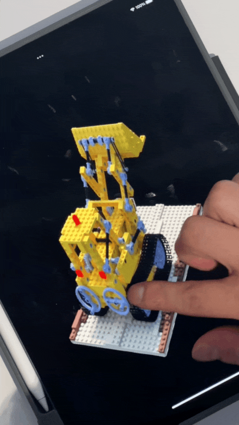
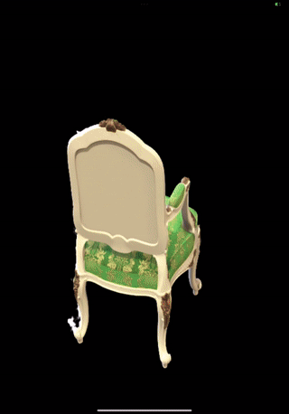
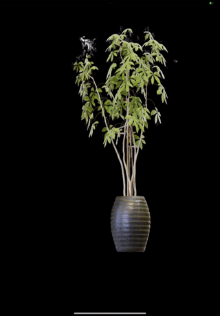
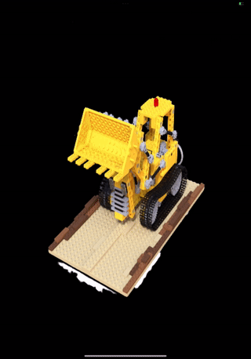
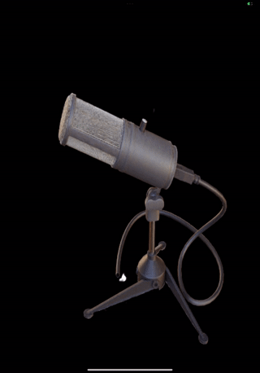

# Taichi NGP Mobile Demo

Deploy your pretrained NGP model on **phones**, **pads**, **VR** and more!

With Taichi AOT, you can deploy Taichi kernels to various platforms: iOS, Android, Windows, MacOS, Linux, ...

> Taichi AOT is not able to deploy pytorch code. 
> This Demo pre-trained a NGP model purely written in Taichi with `scripts/train_nsvf_deploy.sh`
> Please switch to this pipeline if you'd like to re-train a deployable model on your own.

 

Special thanks to [@Linyou](https://github.com/Linyou) for his major contributions to this project!

## iOS Demo
[Checkout our iOS Demo](iOS_Demo)

 

## Android Demo
[Checkout our Android Demo](Android_Demo)
